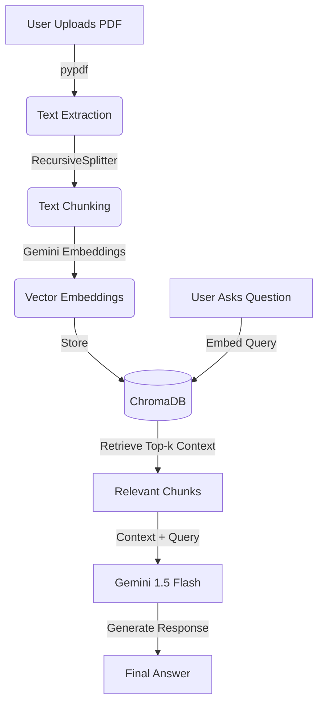

# 📄 AI-Powered PDF Assistant (RAG Pipeline)

A smart **Retrieval-Augmented Generation (RAG)** system that allows users to upload PDF documents and ask natural language questions. The system retrieves relevant context from the document and generates accurate, evidence-based answers using **Google's Gemini 1.5 Flash**.

---

## 🚀 Features

* **🔍 Advanced PDF Processing:** accurately extracts text using `pypdf` and splits it into manageable chunks using LangChain's `RecursiveCharacterTextSplitter`.
* **🧠 Semantic Search:** Utilizes **Google's text-embedding-004** to create high-quality vector embeddings.
* **⚡ Fast Retrieval:** Stores and retrieves vector embeddings using **ChromaDB** for low-latency context fetching.
* **🤖 Hallucination-Free AI:** Powered by **Gemini 1.5 Flash**, ensuring answers are strictly based on the provided document context.
* **🎨 Interactive UI:** Features a clean, user-friendly interface built with **Gradio**, supporting drag-and-drop uploads and chat history.
* **☁️ Cloud Ready:** Optimized to run seamlessly in **Google Colab** (Free Tier GPU/TPU).

---

## 🛠️ Tech Stack

| Component | Technology Used |
| :--- | :--- |
| **LLM** | Google Gemini 1.5 Flash |
| **Embeddings** | Google text-embedding-004 |
| **Vector Database** | ChromaDB (In-memory) |
| **Orchestration** | LangChain |
| **User Interface** | Gradio |
| **Language** | Python |

---

## 🧠 Architecture (RAG Pipeline)

The system follows a standard RAG workflow to ensure accuracy and context awareness:

---

## 📸 Screenshot

### The Interface

> *Example: The user uploads a resume, and the AI extracts key skills and answers questions based on the document context.*

